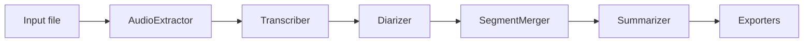

# CLAUDE.md — AI Assistant Guide for VoxScribe

This document provides comprehensive guidance for AI assistants working on the VoxScribe codebase.

---

## Project Overview

**VoxScribe** is an open-source Python tool for local, privacy-preserving transcription and speaker diarization of any audio or video file. It wraps SOTA AI models (faster-whisper, pyannote, WhisperX, Ollama) into a clean CLI and Python library.

**Key goals:**
- Works fully offline — no cloud APIs, no data leaving the machine
- Competitive accuracy with commercial transcription services
- Easy to install and use (`pip install -e . && voxscribe file.mp4`)
- Works as both a CLI tool and an importable Python library

---

## Repository Structure

```
voxscribe/                    Main Python package
  __init__.py                 Public API: Transcriber class, __version__
  cli.py                      Typer CLI entry point
  pipeline.py                 Orchestrator: wires all stages together
  config.py                   Pydantic Settings configuration
  models.py                   Shared dataclasses (WordTimestamp, MergedSegment, …)
  _utils.py                   Internal helpers (resolve_device, format_timestamp, …)

  audio/
    extractor.py              AudioExtractor: FFmpeg wrapper

  transcription/
    base.py                   BaseTranscriber protocol
    faster_whisper.py         FasterWhisperTranscriber (primary backend)
    whisperx.py               WhisperXTranscriber (word-level + integrated diarization)

  diarization/
    base.py                   BaseDiarizer protocol
    pyannote.py               PyannoteDiarizer (SOTA, requires HF token)
    simple.py                 SimpleDiarizer (MFCC + clustering fallback)

  alignment/
    merger.py                 SegmentMerger: aligns transcript ↔ diarization

  summarization/
    ollama.py                 OllamaSummarizer (optional, local LLM)

  exporters/
    base.py                   BaseExporter protocol
    json_exporter.py
    markdown_exporter.py
    srt_exporter.py
    vtt_exporter.py
    txt_exporter.py

scripts/
  check_env.py                Environment validation with rich output

tests/
  conftest.py                 Shared pytest fixtures (synthetic WAV, sample segments)
  test_models.py
  test_merger.py
  test_exporters.py
  test_config.py

pyproject.toml                Build config, dependencies, optional extras, CLI entry point
.env.example                  Template for environment variables
docs/INSTALL.md               Detailed installation guide
docs/CLI.md                   Full CLI reference
docs/ARCHITECTURE.md          Pipeline, data model, backend selection diagrams
```

---

## Architecture

### Data flow



### Internal data model (`voxscribe/models.py`)

All components communicate via typed dataclasses — never raw dicts:

| Class | Produced by | Consumed by |
|---|---|---|
| `TranscriptSegment` | Transcription backends | SegmentMerger |
| `DiarizationSegment` | Diarization backends | SegmentMerger |
| `MergedSegment` | SegmentMerger, WhisperX | Exporters, Summarizer |
| `TranscriptResult` | Pipeline | User / `result.save()` |
| `WordTimestamp` | WhisperX backend | MergedSegment.words |

### Backend selection (pipeline.py)

The pipeline selects backends at runtime based on available packages and config:

1. **Transcription:** `faster-whisper` (default) or `whisperx` (`--backend whisperx`)
2. **Diarization:** `pyannote` (if `HF_TOKEN` + `pyannote-audio` installed) → `SimpleDiarizer` fallback
3. **WhisperX fast path:** when `backend=whisperx` + `diarization=True` + `hf_token` set, transcription + alignment + diarization run in a single WhisperX call (no separate merger step)

### Optional dependencies (graceful degradation)

All optional packages are imported lazily inside the class that needs them and raise `ImportError` with a clear install hint. The pipeline never fails silently — it always logs which backend it selected and why.

---

## Key Files

| Task | File | Class/Function |
|---|---|---|
| CLI argument parsing | `voxscribe/cli.py` | `main()` |
| Pipeline orchestration | `voxscribe/pipeline.py` | `Pipeline.run()` |
| Config resolution | `voxscribe/config.py` | `VoxScribeConfig` |
| Audio extraction | `voxscribe/audio/extractor.py` | `AudioExtractor.extract()` |
| faster-whisper transcription | `voxscribe/transcription/faster_whisper.py` | `FasterWhisperTranscriber.transcribe()` |
| WhisperX integration | `voxscribe/transcription/whisperx.py` | `WhisperXTranscriber.transcribe_with_diarization()` |
| pyannote diarization | `voxscribe/diarization/pyannote.py` | `PyannoteDiarizer.diarize()` |
| MFCC fallback diarization | `voxscribe/diarization/simple.py` | `SimpleDiarizer.diarize()` |
| Segment alignment | `voxscribe/alignment/merger.py` | `SegmentMerger.merge()` |
| Ollama summarization | `voxscribe/summarization/ollama.py` | `OllamaSummarizer.summarize()` |
| Exporter selection | `voxscribe/exporters/__init__.py` | `get_exporter(fmt)` |
| Environment check | `scripts/check_env.py` | `main()` |
| Public API | `voxscribe/__init__.py` | `Transcriber` |

---

## Development Conventions

### Code style
- **Python 3.10+** syntax — use `X | Y` union types (not `Optional[X]`)
- `from __future__ import annotations` in every file
- **PEP 8** + ruff for linting (`ruff check .`)
- **Google-style docstrings** for all public methods
- **Lazy imports** for optional packages: always inside the function body, never at module top-level

### Logging
Use `logger = logging.getLogger(__name__)` in every module. Never use `print()` in library code.

| Level | When to use |
|---|---|
| `INFO` | Major step milestones (model loaded, step complete) |
| `DEBUG` | Detailed diagnostics (FFmpeg command, segment counts) |
| `WARNING` | Degraded mode (fallback backend selected, unknown speakers) |
| `ERROR` | Step failures — always re-raise |

### Error handling
- Check file existence before processing: `if not path.exists(): raise FileNotFoundError`
- Wrap optional imports: `try: import X except ImportError: raise ImportError("install hint")`
- Pipeline-level errors bubble up to the CLI and are presented cleanly with Rich

### Protocol pattern
Backends implement structural protocols (`BaseTranscriber`, `BaseDiarizer`, `BaseExporter`) — no inheritance required. New backends can be added without modifying `pipeline.py`.

---

## Common Modification Scenarios

### Add a new transcription backend
1. Create `voxscribe/transcription/my_backend.py` implementing `transcribe(audio_path) → (list[TranscriptSegment], str|None)`
2. Add the backend to `get_transcriber()` in `voxscribe/transcription/__init__.py`
3. Add the dependency to `pyproject.toml` (optional extra or required)
4. Add a `Literal` to the `backend` field in `VoxScribeConfig`

### Add a new output format
1. Create `voxscribe/exporters/my_format.py` implementing `export(segments, path, *, title, summary)`
2. Register it in `get_exporter()` in `voxscribe/exporters/__init__.py`
3. Add the format key to `_validate_formats` in `VoxScribeConfig`
4. Update the `--format` help text in `cli.py`

### Change diarization model
- Update `_MODEL_COMMUNITY` in `voxscribe/diarization/pyannote.py` — no other changes needed

### Add a new CLI option
1. Add field to `VoxScribeConfig` in `config.py`
2. Add `typer.Option` parameter in `cli.py:main()`
3. Pass the value when constructing `VoxScribeConfig` in `cli.py`
4. Use the field in `pipeline.py` where appropriate

---

## Testing

```bash
pytest                                          # all tests
pytest --cov=voxscribe --cov-report=term-missing
pytest tests/test_exporters.py -v
```

Tests use synthetic audio (`conftest.py:synthetic_wav`) — no real audio files needed for unit tests. Fixtures provide ready-made `sample_transcript_segments`, `sample_diarization_segments`, and `sample_merged_segments`.

---

## Packaging

```bash
pip install -e ".[dev]"       # editable install with dev extras
python -m hatchling build     # build wheel
voxscribe --version           # verify CLI entry point
```

Entry point registered in `pyproject.toml`:
```toml
[project.scripts]
voxscribe = "voxscribe.cli:app"
```

---

## Version History

| Version | Changes |
|---|---|
| 0.1.0 | Complete rewrite as VoxScribe: faster-whisper, pyannote 4.x, WhisperX, Ollama, multi-format export, library API |

---

*Last updated: 2026-03-25*
