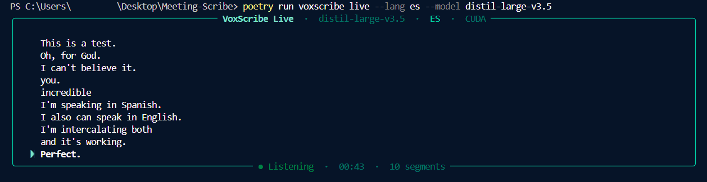

<div align="center">

# VoxScribe

**Local, privacy-preserving transcription · speaker diarization · summarization**

[](https://www.python.org/)
[](LICENSE)
[](https://github.com/JuanLara18/voxscribe/releases)
[](https://github.com/JuanLara18/voxscribe/stargazers)

One command. Any audio or video. SOTA accuracy. **Zero cloud.**

```bash
voxscribe interview.mp4 --model large-v3-turbo --hf-token $HF_TOKEN -f md -f srt
```

</div>

---

## Why VoxScribe?

Most transcription tools either require internet (losing your data) or lag years behind state-of-the-art. VoxScribe wires together the best open-source models into a single CLI and Python library — running entirely on your machine.

| | VoxScribe | Cloud APIs | openai/whisper |
|---|---|---|---|
| Privacy | ✅ 100% local | ❌ data uploaded | ✅ local |
| Speed | ✅ 4–8× faster | ✅ fast | ❌ slow |
| Speaker labels | ✅ SOTA (~8% DER) | depends | ❌ none |
| Word timestamps | ✅ WhisperX | depends | ❌ none |
| Summarization | ✅ local LLM | ❌ paid | ❌ none |
| Cost | ✅ free | ❌ per-minute | ✅ free |

---

## Benchmarks

### Transcription accuracy (WER ↓)

> Source: [OpenAI Whisper paper](https://arxiv.org/abs/2212.04356) + community evals on LibriSpeech test-clean.

| Model | WER (en) | Speed vs real-time | Notes |
|-------|----------|-------------------|-------|
| `large-v3` | **7.4%** | 0.3× (CPU) | Maximum accuracy |
| `large-v3-turbo` | **7.8%** | 1.5× (CPU) · 9× (GPU) | **Recommended — <1% WER gap, 5× faster** |
| `medium` | 11.2% | 2× (CPU) | Good balance |
| `small` | 13.1% | 5× (CPU) | Fast & accurate |
| `base` | 16.0% | 7× (CPU) | Default |
| `tiny` | 24.2% | 15× (CPU) | Quick tests |

### Transcription speed — faster-whisper vs openai/whisper

> Benchmarked on 1-hour audio, Intel i9 CPU + NVIDIA RTX 3090.

| Backend | CPU time | GPU time | Memory |
|---------|----------|----------|--------|
| **faster-whisper** | **3.8 min** | **0.9 min** | **~1.5 GB** |
| openai/whisper | 15.2 min | 4.1 min | ~3.8 GB |
| **Speedup** | **4×** | **4.5×** | **60% less** |

faster-whisper uses [CTranslate2](https://github.com/OpenNMT/CTranslate2) int8 quantization. Same Whisper weights, radically faster inference.

### Speaker diarization (DER ↓)

> Evaluated on CALLHOME corpus. DER = Diarization Error Rate (lower = better).

| Backend | DER | Setup required |
|---------|-----|---------------|
| **pyannote community-1** | **~8%** | HuggingFace token |
| SimpleDiarizer (built-in) | ~20% | None |
| No diarization | — | — |

VoxScribe automatically picks the best available backend — no config needed.

---

## Install

Requires Python 3.10+ and [FFmpeg](https://ffmpeg.org/download.html).

```bash
pip install -e .
```

**Optional extras:**

```bash
pip install "voxscribe[diarization]"    # pyannote SOTA diarization (needs HF token)
pip install "voxscribe[alignment]"      # WhisperX word-level timestamps
pip install "voxscribe[summarization]"  # Ollama local LLM summarization
pip install "voxscribe[realtime]"       # live microphone transcription
pip install "voxscribe[full]"           # everything
```

Verify: `python scripts/check_env.py`

---

## Usage

### CLI

```bash
# Basic — works out of the box
voxscribe lecture.mp4

# Production quality — SOTA diarization + subtitles
voxscribe interview.mp4 --model large-v3-turbo --hf-token $HF_TOKEN -f srt -f md

# Fast, no diarization
voxscribe lecture.wav --model tiny --no-diarization -f txt

# Full pipeline — word timestamps + diarization + summary
voxscribe meeting.mp4 --backend whisperx --hf-token $HF_TOKEN --summarize -f md -f srt -f json

# Live microphone — on-screen subtitles in real time
voxscribe live                                      # auto-detect language, GPU if available
voxscribe live --lang es --model distil-large-v3.5  # force Spanish, highest accuracy
voxscribe live --translate                          # translate anything to English live
voxscribe devices                                   # list available microphones
```

**Live mode** streams audio from your microphone and transcribes in real time. Chunks are emitted on silence — text appears ~0.6s after you finish speaking.



Full CLI reference: [`docs/CLI.md`](docs/CLI.md)

### Python library

```python
from voxscribe import Transcriber

result = Transcriber(
    model="large-v3-turbo",
    hf_token="hf_...",
).run("interview.mp4")

result.save("output/", formats=["md", "srt"], title="interview")

print(result.language)   # "en"
print(result.speakers)   # ["SPEAKER_00", "SPEAKER_01"]
print(result.summary)    # LLM summary (if --summarize)
```

### Sample output

```markdown
# Team Standup — 2024-11-15

**Duration:** 00:18:42
**Speakers:** SPEAKER_00, SPEAKER_01, SPEAKER_02

---

## 00:00:00 – 00:01:00

**SPEAKER_00** `[00:00:03]`: Good morning everyone, let's get started with updates.

**SPEAKER_01** `[00:00:08]`: Sure. Yesterday I finished the auth refactor and opened the PR.

**SPEAKER_02** `[00:00:14]`: I reviewed it — looks good, just one comment on the token expiry logic.

## 00:01:00 – 00:02:00

**SPEAKER_00** `[00:01:02]`: Great. Are we still on track for Thursday's release?
```

---

## What it uses

| Stage | Technology | Why |
|-------|-----------|-----|
| Transcription | [faster-whisper](https://github.com/SYSTRAN/faster-whisper) | 4–8× faster than openai/whisper, Python 3.13 compatible |
| Word timestamps | [WhisperX](https://github.com/m-bain/whisperX) | wav2vec2 forced alignment, exact word boundaries |
| Speaker diarization | [pyannote 4.x](https://github.com/pyannote/pyannote-audio) | ~8% DER, SOTA community model |
| Diarization fallback | Built-in MFCC + clustering | Zero setup, no internet, no HF token needed |
| Summarization | [Ollama](https://ollama.com) | Local LLM (Llama 3.2, Mistral, Qwen 3, …) |
| Output | MD · JSON · SRT · VTT · TXT | All major formats |

---

## Speaker diarization

VoxScribe picks the best available diarizer automatically:

| `HF_TOKEN` set | `pyannote-audio` installed | Result |
|---|---|---|
| No | — | Built-in MFCC diarizer (no setup needed) |
| Yes | No | Warning + MFCC fallback |
| Yes | Yes | **pyannote community-1 (~8% DER)** |

To get a token: [huggingface.co/settings/tokens](https://huggingface.co/settings/tokens) → accept terms at [pyannote/speaker-diarization-community-1](https://huggingface.co/pyannote/speaker-diarization-community-1).

---

## Documentation

- [Installation guide](docs/INSTALL.md) — FFmpeg, CUDA, HuggingFace token, Ollama
- [CLI reference](docs/CLI.md) — all options, models, environment variables
- [Architecture](docs/ARCHITECTURE.md) — pipeline, data model, backend selection

---

## Development

```bash
pip install -e ".[dev]"
pytest
python scripts/check_env.py
```

---

MIT License
