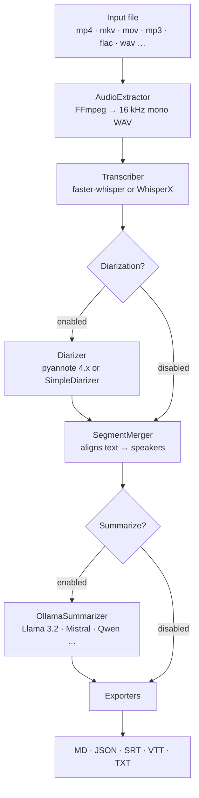
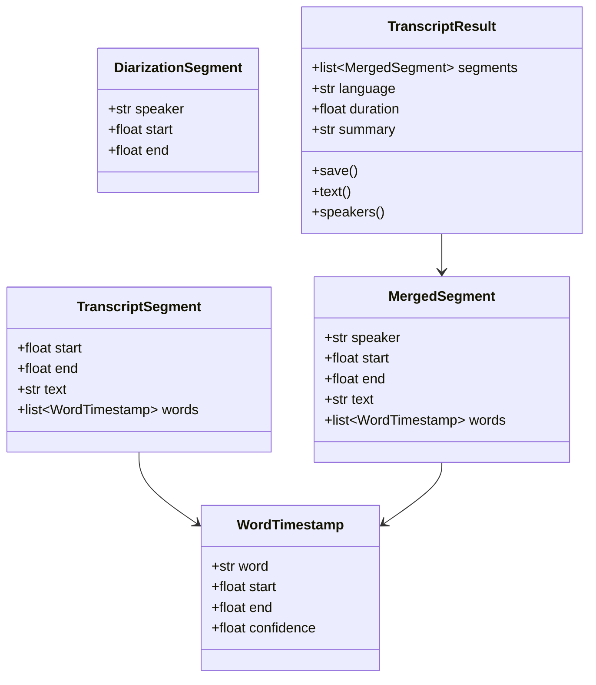
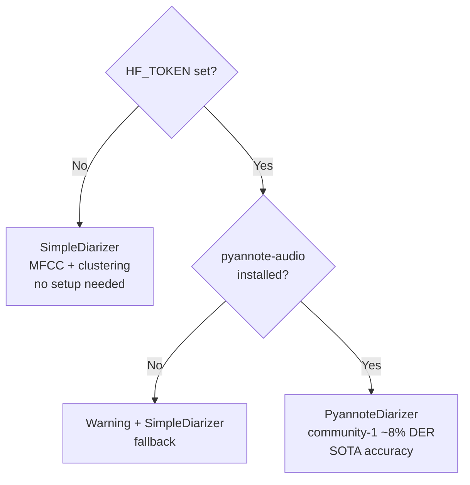
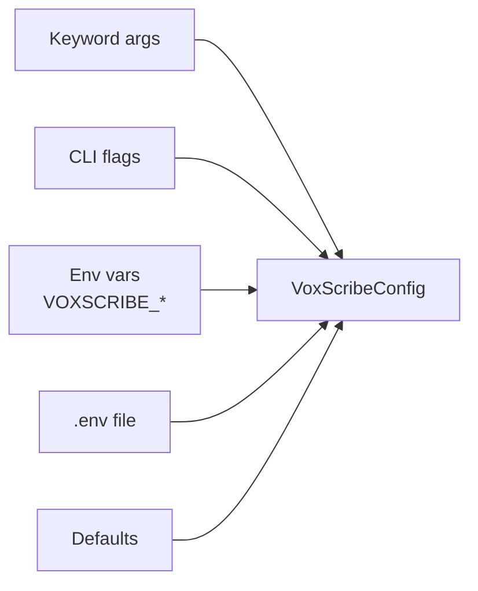

# Architecture

## Pipeline

VoxScribe processes audio and video through five sequential stages:



## Data model

All components communicate through typed dataclasses defined in `voxscribe/models.py`. No raw dicts cross module boundaries.



## Backend selection

The pipeline selects backends at runtime based on installed packages and configuration.

### Transcription

| `--backend` | Library | Notes |
|---|---|---|
| `faster-whisper` | [faster-whisper](https://github.com/SYSTRAN/faster-whisper) | Default. Always available. 4× faster than openai/whisper. |
| `whisperx` | [WhisperX](https://github.com/m-bain/whisperX) | Word-level timestamps via forced alignment. Optional. |

### Diarization



### WhisperX integrated path

When `--backend whisperx` + `--hf-token` are both set, the pipeline calls WhisperX's integrated diarization (transcription + forced alignment + pyannote speaker assignment in a single pass), bypassing the separate diarization and merger steps.

## Protocol pattern

Backends implement structural protocols — no inheritance required:

```python
class BaseTranscriber(Protocol):
    def transcribe(self, audio_path: Path) -> tuple[list[TranscriptSegment], str | None]: ...

class BaseDiarizer(Protocol):
    def diarize(self, audio_path: Path, ...) -> list[DiarizationSegment]: ...

class BaseExporter(Protocol):
    def export(self, segments: list[MergedSegment], output_path: Path, ...) -> None: ...
```

Adding a new backend = implement the protocol in a new file. No changes to `pipeline.py`.

## Configuration priority



## Package structure

```
voxscribe/
  __init__.py            Public API: Transcriber, VoxScribeConfig, models
  cli.py                 Typer CLI (thin wrapper around Pipeline)
  pipeline.py            Orchestrator
  config.py              Pydantic Settings
  models.py              Shared dataclasses
  _utils.py              Internal helpers

  audio/
    extractor.py         AudioExtractor (FFmpeg)

  transcription/
    base.py              BaseTranscriber protocol
    faster_whisper.py    FasterWhisperTranscriber
    whisperx.py          WhisperXTranscriber

  diarization/
    base.py              BaseDiarizer protocol
    pyannote.py          PyannoteDiarizer
    simple.py            SimpleDiarizer (MFCC fallback)

  alignment/
    merger.py            SegmentMerger

  summarization/
    ollama.py            OllamaSummarizer

  exporters/
    base.py              BaseExporter protocol
    json_exporter.py
    markdown_exporter.py
    srt_exporter.py
    vtt_exporter.py
    txt_exporter.py
```
